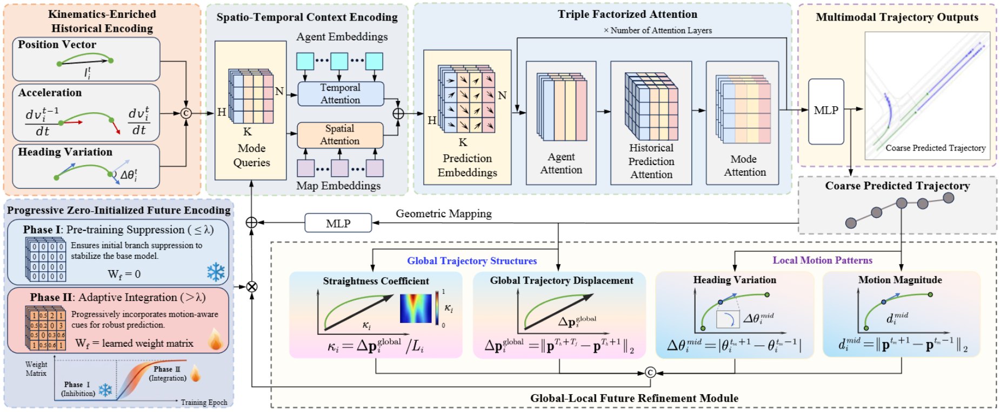
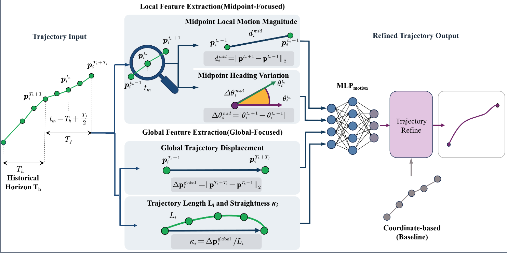
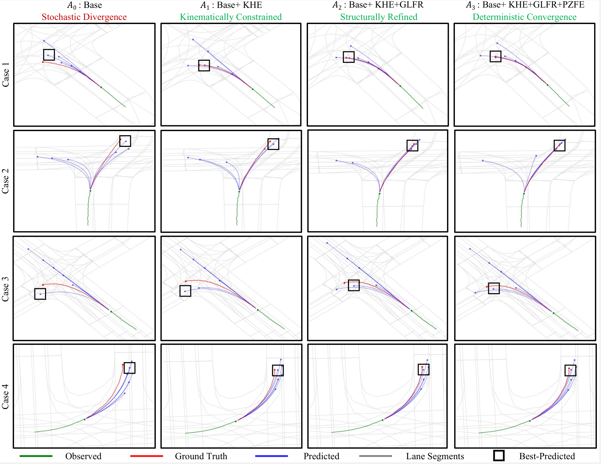
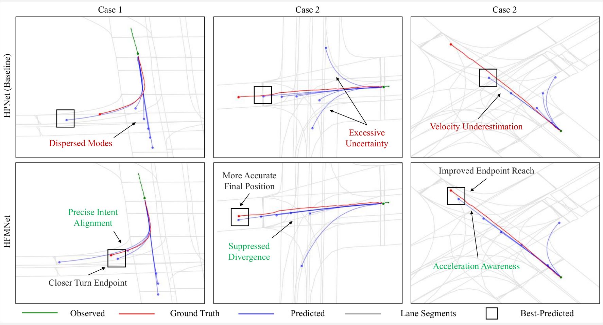
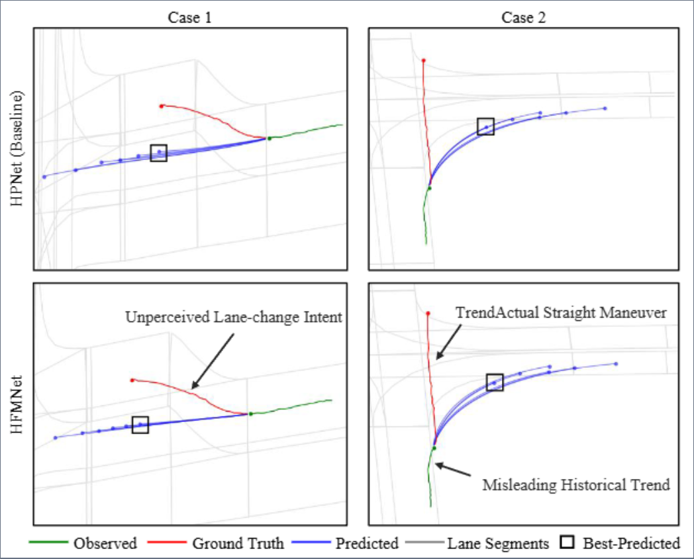

# HFMNet: A Unified Motion-Aware Multimodal Trajectory Forecasting Framework

**Official PyTorch Implementation** of the paper  
**"HFMNet: A Unified Motion-Aware Multimodal Trajectory Forecasting Framework with Kinematic Priors and Structural Encoding"**  

![HFMNet Overview]

---

## 📋 Table of Contents

- [Overview](#overview)
- [Key Features & Contributions](#key-features--contributions)
- [Performance](#performance)

---

## Overview

HFMNet is a **motion-aware dynamic forecasting framework** that goes beyond traditional geometry-dominant trajectory prediction. It explicitly incorporates **high-order kinematic priors** and **global-local structural encoding** to achieve more accurate, physically plausible, and stable multimodal trajectory predictions in complex urban scenarios.

Built on the HPNet backbone, HFMNet introduces three core innovations:
- **Kinematics-Enriched Historical Encoding (KHE)**
- **Global-Local Future Refinement (GLFR)**
- **Progressive Zero-Initialized Future Encoding (PZFE)**

It achieves **SOTA** results on Argoverse 1 (minADE/minFDE = 0.7583/1.0901, MR = 0.103) and strong generalization on INTERACTION.

> **Paper Abstract**  
Accurate and stable trajectory prediction provides the proactive foresight necessary for autonomous agents to navigate complex, high-frequency interactions. While recent dynamic forecasting paradigms attempt to model temporal dependencies, they often rely on under-specified motion representations and heuristic refinement schemes, treating predicted paths as mere coordinate sequences while overlooking their underlying physical and structural properties. To address this, we propose HFMNet, a motion-aware dynamic forecasting framework designed for robust urban intelligence. Specifically, we first introduce Kinematics-Enriched Historical Encoding to augment agent state modeling with high-order kinematics, enabling the model to capture intrinsic motion agility beyond simple positional shifts. Furthermore, we design Global-Local Future Refinement, a descriptor module that encodes global structural characteristics and local motion patterns for expressive reasoning over future paths. To ensure stable optimization when integrating noisy, early-stage predictions, a Progressive Zero-initialized Future Encoding strategy is formulated to adaptively regulate information flow and prevent representation degradation. Extensive experiments on the Argoverse 1 benchmark demonstrate that HFMNet achieves state-of-the-art predictive precision, reducing \textbf{minADE/minFDE to 0.7583/1.0901} and achieving a competitive \textbf{Miss Rate (MR) of 0.103} on the test set. These results validate HFMNet's superiority in capturing complex agent behaviors, offering a reliable technological foundation for safe and accessible 15-minute cities.

---

## Key Features & Contributions

- **KHE** — Enriches historical observations with acceleration magnitude and heading variation (beyond raw (x, y)).
- **GLFR** — Extracts **local** (midpoint motion/heading) + **global** (displacement/straightness) descriptors from candidate anchors for expressive refinement.

- **PZFE** — Zero-initialized residual pathway + progressive activation to stabilize training with noisy early-stage predictions.
- Triple Factorized Attention + Anchor-based future modeling for rich spatio-temporal interactions.
- Winner-Takes-All training with two-stage regression + mode classification.

All components are **modular** and easily swappable/extensible (see [How to Extend](#how-to-extend-hfmnet)).

---

## Performance

### Argoverse 1 (Test Set)

| Model          | minADE↓ | minFDE↓ | MR↓   | brier-FDE↓ |
|----------------|---------|---------|-------|------------|
| HPNet (baseline) | 0.7612 | 1.0986 | 0.1067 | 1.7375    |
| **HFMNet (Ours)** | **0.7583** | **1.0901** | **0.103** | **1.7269** |
| ILNet          | 0.772  | 1.099  | 0.106 | 1.745     |
| DGFNet         | 0.770  | 1.11   | 0.108 | 1.74      |

*(Full table in the paper – validation + more baselines included)*

### INTERACTION (Validation – Joint Prediction)

| Model          | minJointADE↓ | minJointFDE↓ |
|----------------|--------------|--------------|
| HPNet          | 0.1739       | 0.5577       |
| **HFMNet**     | **0.1674**   | **0.5512**   |

---
